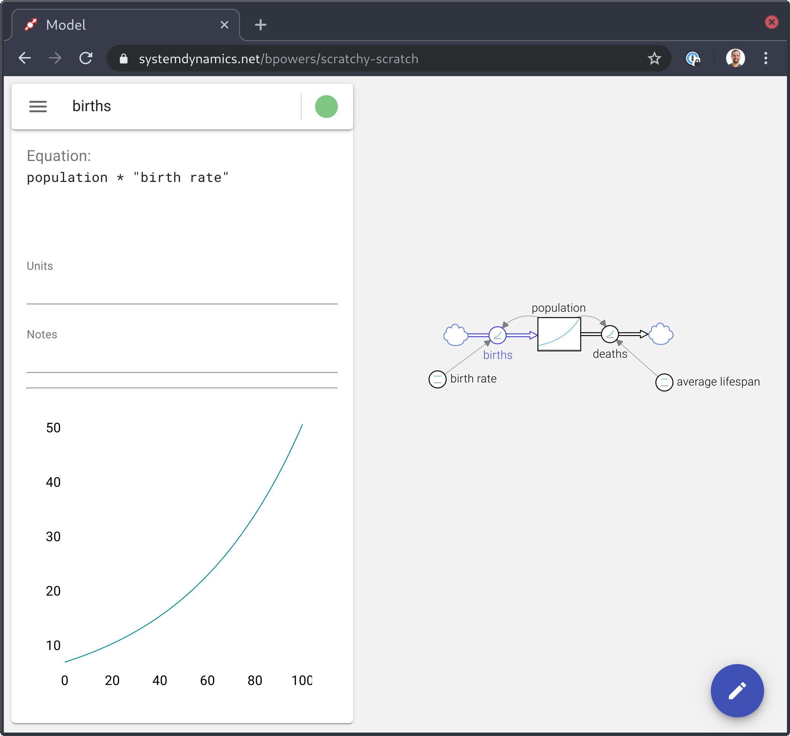

# system dynamics Model editor

[](https://david-dm.org/bpowers/model-app)
[](https://david-dm.org/bpowers/model-app?type=dev)




## Local development

```bash
# dependencies; ignore warning about immutable
$ (yarn install; cd app && yarn install)
# start mongo
$ ./start-mongo
# in another tab:
$ . ~/model-oauth # (get out of band)
$ yarn start:backend
# in third and final tab:
$ yarn start:frontend

```

Now to the browser!

Visit http://localhost:3030/auth/google to kick off an oauth request.  Once that is done, you can start local development + iteration on http://localhost:3000/
