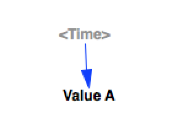

Active Initial
===========

This model tests Vensim's build in `ACTIVE INITIAL` function. It does not represent the way the function would actually be used in a model, but is simple and gives testable output.

It is interesting to note that the function seems to behave differently at 'initialization time' versus at 'run time'. The value at the starting time in the simulation result is the value of the 'active' component, not the value of the 'initial'. This seems to imply a logic which is not just:
```
   if t=t0:
      return initial
   else:
      return active
```
but something more status-aware. This could be harder to incorporate than I thought.  



Contributions
-------------

| Component                         | Author         | Contact                    | Date    | Software Version        |
|:--------------------------------- |:-------------- |:-------------------------- |:------- |:----------------------- |
| `test_active_initial.mdl` | James Houghton | james.p.houghton@gmail.com | 2/18/16 | Vensim DSS 6.3E for mac |
| `output.tab`              | James Houghton | james.p.houghton@gmail.com | 2/18/16 | Vensim DSS 6.3E for mac |


