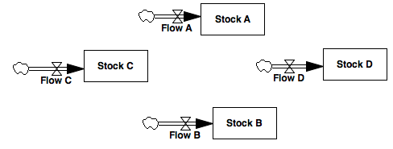

Chained Initialization
===========

This model tests stocks whose initial values depend on other stock values. This condition requires that a simulation engine resolve the order in which a stock is initialized. If the simulation engine attempts to initialize a stock that has uninitialized dependencies, it should be able to handle the exception.

In this model, `stock B`'s initialization depends on the values of all the other stocks. 

Contributions
-------------

| Component                         | Author         | Contact                    | Date    | Software Version        |
|:--------------------------------- |:-------------- |:-------------------------- |:------- |:----------------------- |
| `test_chained_initialization.mdl` | James Houghton | james.p.houghton@gmail.com | 2/18/16 | Vensim DSS 6.3E for mac |
| `output.tab`                      | James Houghton | james.p.houghton@gmail.com | 2/18/16 | Vensim DSS 6.3E for mac |

