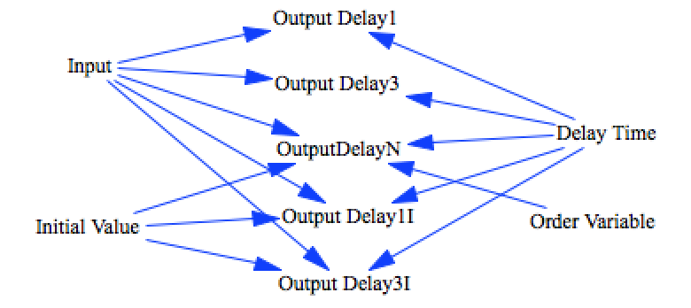

Test Delay Functions
===========

This model tests basic delay functions:

- Delay1, Delay3, DelayN
- Delay1I, Delay3I

It does not test infinite order delays, as these require a separate representation, 
despite being similar in concept, and not all tools will choose to support it.

Note that this test is updated from a previous version in order to make it more robust.

Contributions
-------------

| Component                         | Author          | Contact                    | Date    | Software Version        |
|:--------------------------------- |:--------------- |:-------------------------- |:------- |:----------------------- |
| test_delays.mdl                   | James Houghton  | james.p.houghton@gmail.com | 10/2/17 | Vensim DSS 7.1a for Mac  |
| output.csv                        | James Houghton  | james.p.houghton@gmail.com | 10/2/17 | Vensim DSS 7.1a for Mac  |
