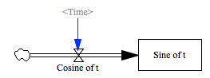

Test Euler Integrator Step Size
===============================

This model tests whether an euler integrator properly handles the `step size` argument for its integration, and the `Save Per` argument for results. 

The cosine is set to have a period equal to the `save per` time.

If everything works properly, the value for `Sine of t` will be a flat line.

If instead, it uses the `save per` value for the step size, the value will grow linearly, as the cosine will be at the same place in its curve (1) each timestep.

If it uses the `step size` as the `save per`, then the value will oscillate according to the sin function.

Contributions
-------------

| Component                         | Author          | Contact                    | Date    | Software Version        |
|:--------------------------------- |:--------------- |:-------------------------- |:------- |:----------------------- |
| `test_euler_step_vs_saveper.mdl`  | James Houghton  | james.p.houghton@gmail.com | 2/04/16 | Vensim DSS 6.3E for Mac |
| `output.tab`                      | James Houghton  | james.p.houghton@gmail.com | 2/04/16 | Vensim DSS 6.3E for Mac |
