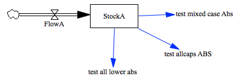

Test Function Capitalization
============================

This model tests the ability to parse function calls with variously capitalized names 
`Max(..)`, `MAX(..)`, and `max(..)` should all work. 

I don't feel a need to test `mAx(..)` at this point, though.

Note that I modified the 'mdl' file in a text editor, as my version of Vensim forces function calls to capitals. If the file is modified, better check this again.

Contributions
-------------

| Component                          | Author          | Contact                    | Date    | Software Version        |
|:---------------------------------- |:--------------- |:-------------------------- |:------- |:----------------------- |
| `test_function_capitalization.mdl` | James Houghton  | james.p.houghton@gmail.com | 2/4/16  | Vensim DSS 6.3E for Mac |
| `output.tab`                       | James Houghton  | james.p.houghton@gmail.com | 2/4/16  | Vensim DSS 6.3E for Mac |

TODO
----
- xmile, stella models