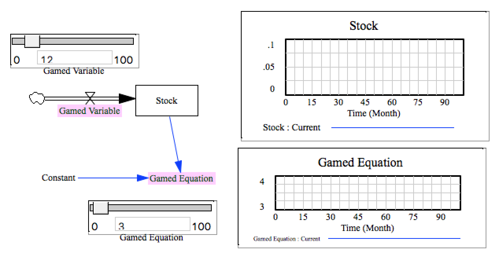

Test Function Capitalization
============================

This model tests the parser's ability to handle the GAME function.

The syntax seems basically to be:

```
GAME(whatever the equation would otherwise be)
```

so if the implementation is not planning to do anything *with* the gaming interface, it should be safe to just replace this with a set of parentheses:

```
(whatever the equation would otherwise be)
```

Vensim doesn't seem to allow you to do things like:

```
GAME(A + B) * C 
```
So we shouldn't in theory have to worry about order of operations coming to play, but it would still be good to handle that case.





Contributions
-------------

| Component                          | Author          | Contact                    | Date    | Software Version        |
|:---------------------------------- |:--------------- |:-------------------------- |:------- |:----------------------- |
| `test_game.mdl` | James Houghton  | james.p.houghton@gmail.com | 3/14/17  | Vensim DSSDP 6.4E for Mac |
| `output.tab`                       | James Houghton  | james.p.houghton@gmail.com | 3/14/17  | Vensim DSSDP 6.4E for Mac |

