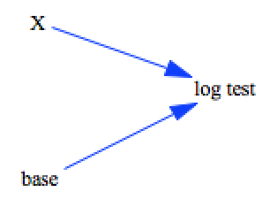

test_exp
=========

This model tests the `LOG` logarithm function with change of base.

In response to [Issue 122](https://github.com/SDXorg/pysd/issues/122)

Vensim Syntax is `LOG(X, base)` documented [here](https://www.vensim.com/documentation/index.html?fn_log.htm)

Contributions
-------------

| Component                         | Author          | Contact                    | Date    | Software Version        |
|:--------------------------------- |:--------------- |:-------------------------- |:------- |:----------------------- |
| test_log.mdl                       | James Houghton  | james.p.houghton@gmail.com | 7/07/17 | Vensim DSS 6.4E for Mac  |
| output.csv                        | James Houghton  | james.p.houghton@gmail.com | 7/07/17 | Vensim DSS 6.4E for Mac  |
