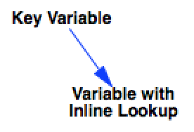

Test Inline Lookups
===================

This tests the vensim syntax for lookup definition as they are created inline:

```
Variable with Inline Lookup=
	WITH LOOKUP(Key Variable, ((0,0),(5,0.01),(20,0.2),(30,0.5),(70,0.9),(90.353,0.99),(100,1)) )
```




Contributions
-------------

| Component                      | Author          | Contact                    | Date    | Software Version        |
|:------------------------------ |:--------------- |:-------------------------- |:------- |:----------------------- |
| `test_lookups_inline.mdl`     | James Houghton  | james.p.houghton@gmail.com | 6/28/16 | Vensim DSS 6.3E for Mac  |
| output.csv                     | James Houghton  | james.p.houghton@gmail.com | 6/28/16 | Vensim DSS 6.3E for Mac  |
