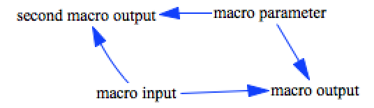

Test Multiple macro definitions
============

This model defines two separate macros, and tests that they can both be parsed and used.

Contributions
-------------

| Component                      | Author          | Contact                    | Date    | Software Version        |
|:------------------------------ |:--------------- |:-------------------------- |:------- |:----------------------- |
| `test_macro_multiple_macros.mdl`           | James Houghton  | james.p.houghton@gmail.com | 9/23/16 | Vensim DSS 6.3E for Mac |
| `output.csv `                    | James Houghton  | james.p.houghton@gmail.com | 9/23/16 | Vensim DSS 6.3E for Mac |

