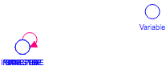

Test Model-Level Documentation
============
Vensim gives the option to add notes to the model itself, which can serve as a sort of model-level documentation. 

System Dynamicists should probably use these mode often.

Contributions
-------------

| Component                      | Author          | Contact                    | Date    | Software Version        |
|:------------------------------ |:--------------- |:-------------------------- |:------- |:----------------------- |
| model_doc.mdl                  | James Houghton  | james.p.houghton@gmail.com | 3/22/16 | Vensim DSS 6.3 for Mac  |

TODO
----
