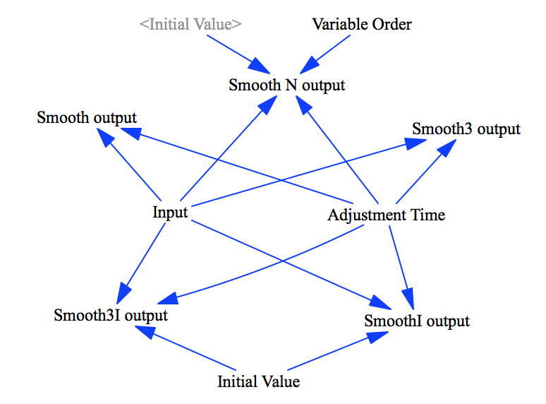

Test Smooth Functions
===========

This model tests basic smoothing functionality

-Smooth, Smooth3, Smooth N
-SmoothI, Smooth3I

Note: This test originally started the input series at 0. This allowed for an error if the implemented functions initialized at 0, a likely occurrence.

Contributions
-------------

| Component                         | Author          | Contact                    | Date    | Software Version        |
|:--------------------------------- |:--------------- |:-------------------------- |:------- |:----------------------- |
| test_smooth.mdl                   | James Houghton  | james.p.houghton@gmail.com | 10/2/17 | Vensim DSS 7.1a for Mac  |
| output.tab                        | James Houghton  | james.p.houghton@gmail.com | 10/2/17 | Vensim DSS 7.1a for Mac  |
