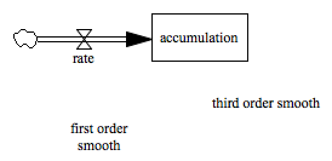

Test Smooth and Stock
===========

This model tests if we have single-valued stock variables and array-type other variables (smooth here, could be a subscripted variable) that the integrator handles both types of state representation properly.

Contributions
-------------

| Component                         | Author          | Contact                    | Date    | Software Version        |
|:--------------------------------- |:--------------- |:-------------------------- |:------- |:----------------------- |
| test_smooth_and_stock.mdl         | James Houghton  | james.p.houghton@gmail.com | 3/03/17 | Vensim DSS 6.4E for Mac  |
| output.tab                        | James Houghton  | james.p.houghton@gmail.com | 3/03/17 | Vensim DSS 6.4E for Mac  |
