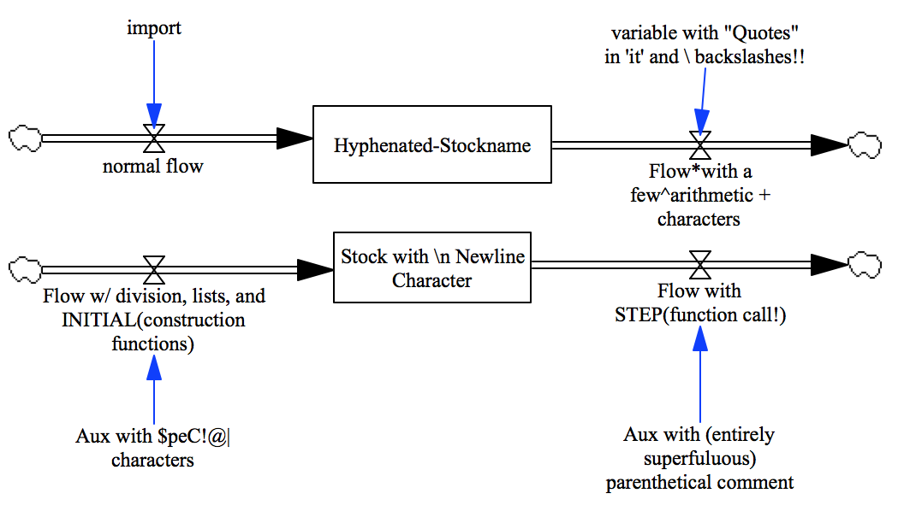

Test special variable names
===========================

This model tests the use of several special characters and constructions in variable names:

- Non Alphanumeric Characters
- Newline characters
- Arithemtic Operators
- Function Calls within Variable Names
- Commas, lists
- Parenthetical Comments
- Hyphenated Names
- Single and Double Quotation Marks
- Backslashes

Contributions
-------------

| Component                         | Author          | Contact                    | Date    | Software Version        |
|:--------------------------------- |:--------------- |:-------------------------- |:------- |:----------------------- |
| `test_special_variable_names.mdl`  | James Houghton  | james.p.houghton@gmail.com | 6/20/18 | Vensim DSS 7.2 for Mac  |
| `output.tab `                      | James Houghton  | james.p.houghton@gmail.com | 6/20/18 | Vensim DSS 7.2 for Mac  |
