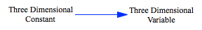

Test Subscript 3D Arrays defined widthwise
========================

In this case we define a 3d constant where each equation is defined for a different value of the first subscript listed, instead of the third.

Contributions
-------------

| Component                         | Author          | Contact                    | Date    | Software Version        |
|:--------------------------------- |:--------------- |:-------------------------- |:------- |:----------------------- |
| `test_subscript_3d_arrays_lengthwise.mdl`      | James Houghton  | james.p.houghton@gmail.com | 06/26/16 | Vensim DSS 6.3E for Mac  |

