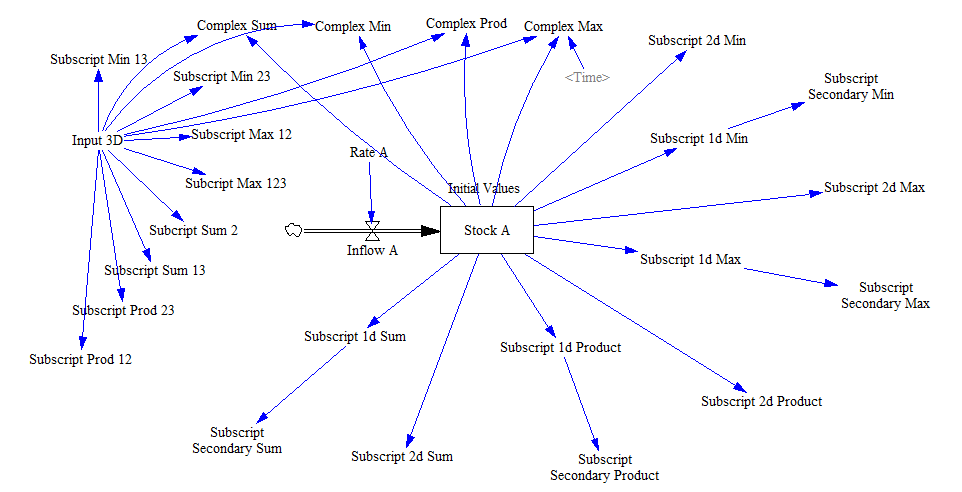

Test Subscript Aggregation
==========================

This test aggregates the result of several subscripts using the various aggregation functions. It is tested over variables of 1, 2 and 3 dimensions for different combinations and also for complex definitions where the aggregation functions wrap a non-aggregation function (IF THEN ELSE in this case). 

Contributions
-------------

| Component                                   | Author          | Contact                         | Date     | Software Version              |
|:------------------------------------------- |:--------------- |:------------------------------- |:-------- |:----------------------------- |
| test_subscript_aggregation.mdl              | James Houghton  | james.p.houghton@gmail.com      | 10/20/15 | Vensim DSS 6.3 for Mac        |
| output.csv                                  | James Houghton  | james.p.houghton@gmail.com      | 10/20/15 | Vensim DSS 6.3 for Mac        |
| test_subscript_aggregation.mdl (expanded)   | Eneko Martin    | eneko.martin.martinez@gmail.com | 12/04/20 | Vensim DSS 7.3.4 for Windows  |
| output.tab (replaces output.csv)            | Eneko Martin    | eneko.martin.martinez@gmail.com | 12/04/20 | Vensim DSS 7.3.4 for Windows  |
| test_subscript_aggregation.mdl (updatedd)   | Eneko Martin    | eneko.martin.martinez@gmail.com | 04/26/20 | Vensim DSS 7.3.4 for Windows  |
| output.tab (updated)                        | Eneko Martin    | eneko.martin.martinez@gmail.com | 04/26/20 | Vensim DSS 7.3.4 for Windows  |
