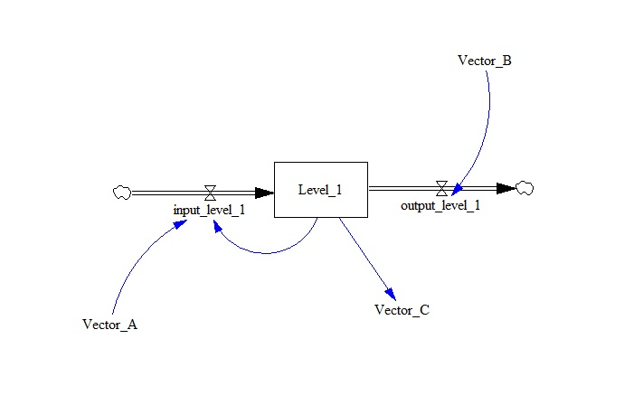

test_subscript_copy
===================

This model tests the subscript copy both when the copy happend before and after the original subscript range is defined.

Contributions
-------------

| Component                      | Author          | Contact                          | Date     | Software Version                   |
|:------------------------------ |:--------------- |:-------------------------------- |:-------- |:---------------------------------- |
| Subscript_copy_model.mdl       | María Robles    | maria.robles.delblanco@gmail.com | 12/5/21  | Vensim DSS 8.0.9 for Windows (x64) |
| output.tab                     | María Robles    | maria.robles.delblanco@gmail.com | 12/5/21  | Vensim DSS 8.0.9 for Windows (x64) |
| Subscript_copy_model2.mdl      | Eneko Martin    | eneko.martin.martinez@gmail.com  | 03/11/21 | Vensim DSS 8.0.9 for Windows (x64) |
