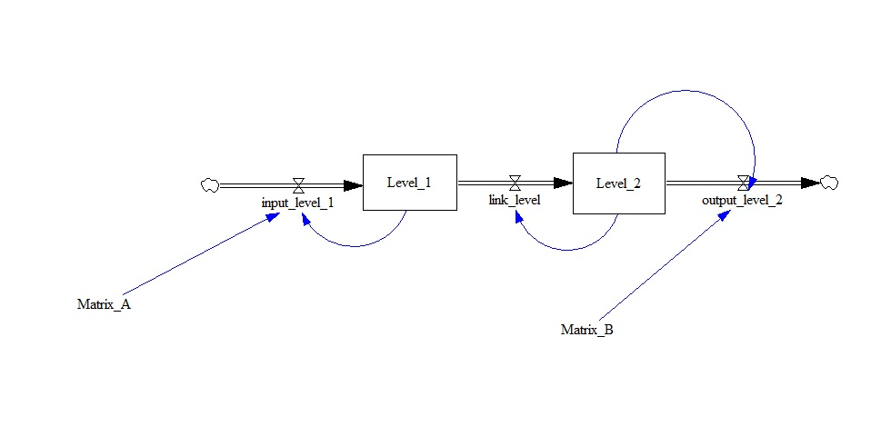

test_mapping
============

There are a number of different features that make up the full functionality we know as 
'subscripts'. We'll break them all into separate tests to ease the development effort.

This model tests the subscript mapping which has the same effect as subscript copy.

Contributions
-------------

| Component                      | Author          | Contact                    | Date    | Software Version        |
|:--------------------------------- |:--------------- |:-------------------------- |:------- |:----------------------- |
| Subscript_mapping_simple.mdl       | María Robles    | maria.robles.delblanco@gmail.com | 12/5/21  | Vensim DSS 8.0.9 for Windows (x64) |
| output.tab                     | María Robles    | maria.robles.delblanco@gmail.com | 12/5/21  | Vensim DSS 8.0.9 for Windows (x64) |
| `output.tab `             | Eneko Martin | eneko.martin.martinez@gmail.com | 03/01/22 | Vensim DSS for Windows 7.3.4 double precision (x32)   

