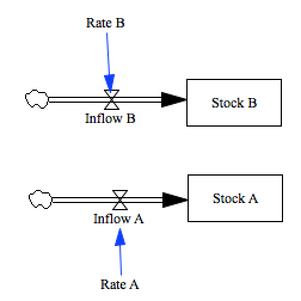

Test multiple subscripts
========================

There are a number of different features that make up the full functionality we know as 
'subscripts'. We'll break them all into separate tests to ease the development effort.

We'll test here a case in which different parts of the model use different subscript families. In this case:

```
One Dimensional Subscript:
	Entry 1, Entry 2, Entry 3
	~	
	~		|
Parallel Subscript:
	Another Element 1, Another Element 2, Another Element 3, Another Element 4
	~	
	~		|
```





Contributions
-------------

| Component                         | Author          | Contact                    | Date    | Software Version        |
|:--------------------------------- |:--------------- |:-------------------------- |:------- |:----------------------- |
| test_multiple_subscripts.mdl      | James Houghton  | james.p.houghton@gmail.com | 9/18/15 | Vensim DSS 6.3E for Mac  |
| output.tab                        | James Houghton  | james.p.houghton@gmail.com | 9/18/15 | Vensim DSS 6.3E for Mac  |
