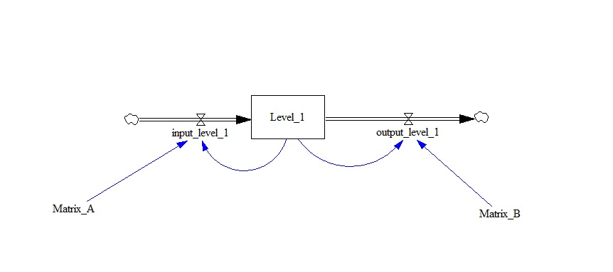

test_subscript_numeric_range
============

This model tests the numeric range in a subscript definition.

Contributions
-------------

| Component                         | Author          | Contact                    | Date    | Software Version        |
|:--------------------------------- |:--------------- |:-------------------------- |:------- |:----------------------- |
| test_subscript_numeric_range.mdl | María Robles    | maria.robles.delblanco@gmail.com | 10/3/21  | Vensim DSS 8.0.9 for Windows (x64) |
| output.tab              | María Robles    | maria.robles.delblanco@gmail.com | 10/3/21  | Vensim DSS 8.0.9 for Windows (x64) |
