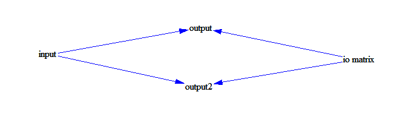

Test subscript transposition
============================

This model tests the subscript dimension transposition for a variable io matrix[sector, sector1] called as io matrix[sector, sector1] and io matrix[sector1, sector].

Contributions
-------------

| Component                          | Author       | Contact                         | Date     | Software Version                                     |
|:---------------------------------- |:------------ |:------------------------------- |:-------- |:---------------------------------------------------- |
| `test_subscript_transposition.mdl` | Eneko Martin | eneko.martin.martinez@gmail.com | 12/02/20 | Vensim DSS for Windows 7.3.4 single precision (x32)  |
| `output.tab `                      | Eneko Martin | eneko.martin.martinez@gmail.com | 12/02/20 | Vensim DSS for Windows 7.3.4 single precision (x32)  |
