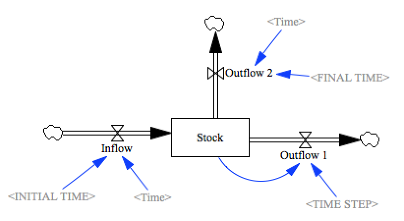

Test Time
=========

This model tests the use of the timekeeping components in a model:

- Time, Time Step, 
- Initial Time, Final Time

Contributions
-------------

| Component                         | Author          | Contact                    | Date    | Software Version        |
|:--------------------------------- |:--------------- |:-------------------------- |:------- |:----------------------- |
| `test_time.mdl`                     | James Houghton  | james.p.houghton@gmail.com | 8/10/17 | Vensim DSS 6.4E DP for Mac  |
| `output.tab`                        | James Houghton  | james.p.houghton@gmail.com | 8/10/17 | Vensim DSS 6.4E DP for Mac  |
