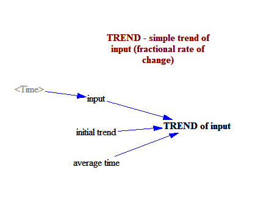

Test Trend Functions
===========

This model tests basic trend functionality

Contributions
-------------

| Component                         | Author          | Contact                    | Date    | Software Version            |
|:--------------------------------- |:--------------- |:-------------------------- |:------- |:--------------------------- |
| test_trend.mdl                    | Manuel Ruh      | manuelrugue@gmail.com      | 10/4/17 | Vensim PLE 7.1  for Windows |
| output.csv                        | Manuel Ruh      | manuelrugue@gmail.com      | 10/4/17 | Vensim PLE 7.1  for Windows |
