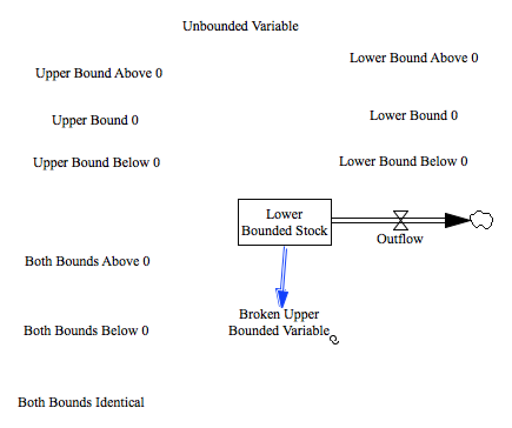

Test Variable Ranges
=========

This model incorporates statements about the valid ranges that variables can take on. It violates those constraints, in order to test that they can be checked and raise exceptions in appropriate ways.

For example, the stock below is valid for all values between $0$ and $+\infty$

```
Stock= INTEG (
	-Outflow,
		10)
	~	 [0,?]
	~		|
```

While the following variable is valid from $-\infty$ values up to and including $3$

```
Variable=
	Stock
	~	 [?,3]
	~		|
```

A number of other types of boundary combinations are also included, in order to test things like parameter space exploration algorithms.




Just running this test isn't quite enough, as the behavior it should be testing is that an error or warning is raised in the appropriate times.


Contributions
-------------

| Component                         | Author          | Contact                    | Date    | Software Version        |
|:--------------------------------- |:--------------- |:-------------------------- |:------- |:----------------------- |
| `test_variable_range.mdl`                     | James Houghton  | james.p.houghton@gmail.com | 8/08/17 | Vensim DSS 6.4E DP for Mac  |
| output.tab                        | James Houghton  | james.p.houghton@gmail.com | 8/08/17 | Vensim DSS 6.4E DP for Mac  |
